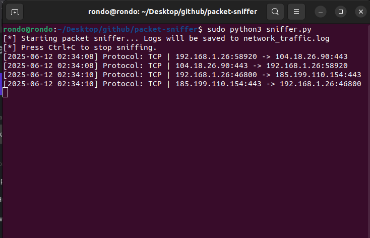
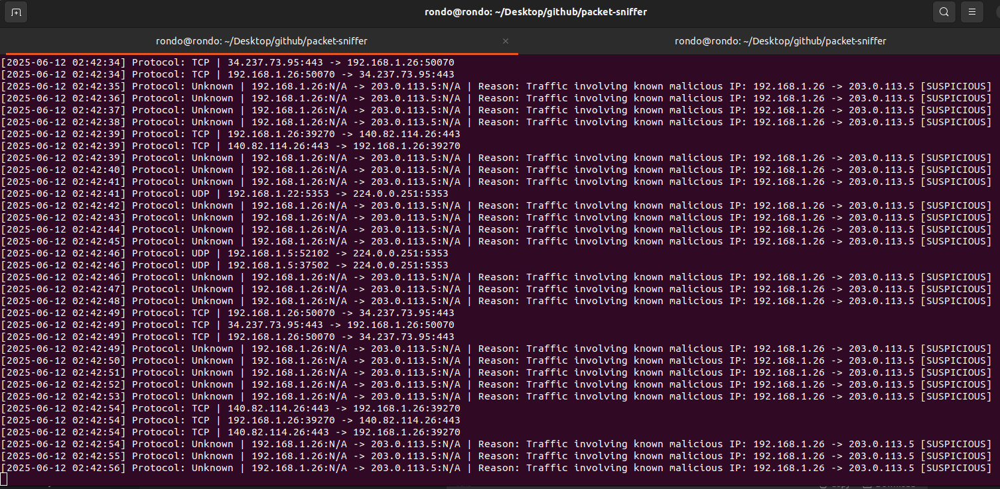
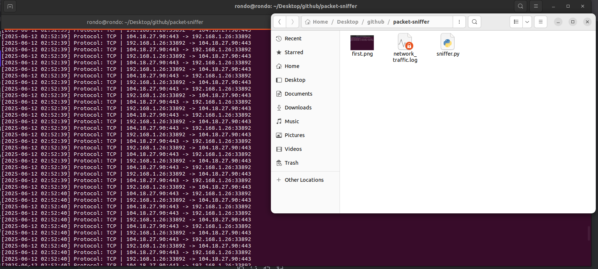

# Network Packet Sniffer & Analyzer

A Python-based network packet sniffer that monitors traffic and detects suspicious activity using Scapy.

## Features

- Captures IP, TCP, and UDP packets in real-time
- Detects traffic involving known malicious IPs
- Identifies suspicious port activity (like C2 communication ports)
- Logs all network activity with timestamps
- Lightweight and easy to customize

## Demo

### Normal Traffic Detection

### Malicious IP Detection

*Alert when traffic matches known malicious IP addresses*

### Log File Output

